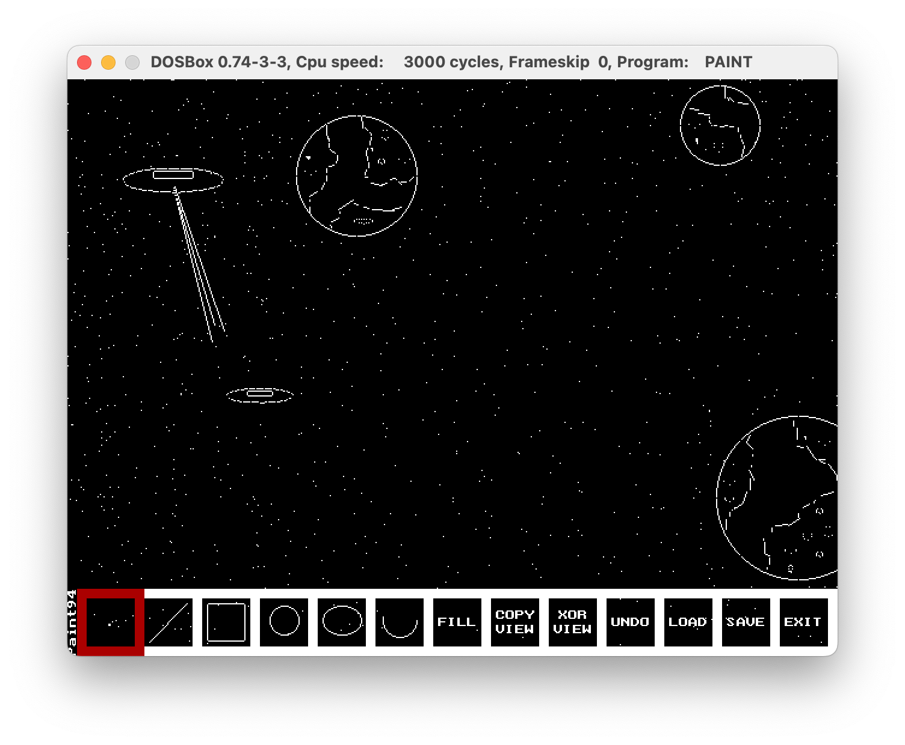

# Paint

A simple drawing program that I wrote a few decades ago. Read further if you want to know the whole story.

Some remarks:

* The code is overly commented (because it had to be - read below)
* I have done some code linting before publishing but mostly convert the code page. This is still the original code.

## Folders

* bin - the executable (including the sample file JORGE.PNT)
* BORLAND/BGI - Borland Graphics Interface (BGI) driver
* img - application screenshots
* original - original source code (before the linting) - don't look at this, the formatting sucks
* src - the linted code
* tools - some tools used to clean up the code

## BGI Driver

The application uses Borland's Graphics Interface (BGI) driver and it hardcodes the path on drive `F:\`. Thus, just follow the mount as done below in the DOS emulator.

## DOS Emulator

To run this application using [Dosbox](https://www.dosbox.com/) do:

```bash
Z:\>mount f /path/to/paint/folder

Z:\>F:
F:\>cd BIN
F:\>PAINT.EXE
```



## The Story

This was a school project around 1993-94. The code is heavily commented because that was required for the grading.

I don't remember exactly but I think the project was to write something in C but using some Object-Oriented Programming concepts. In this case that would be the different shapes (structures in [GLOBAL.H](src/GLOBAL.H)).

## License

Released under the [MIT License](http://www.opensource.org/licenses/MIT).
